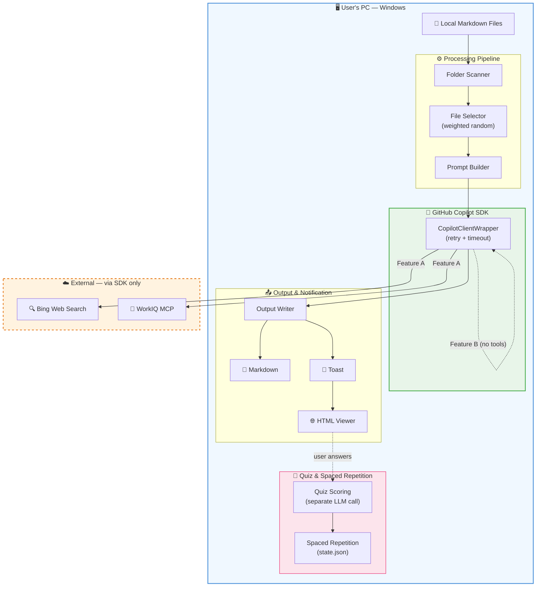
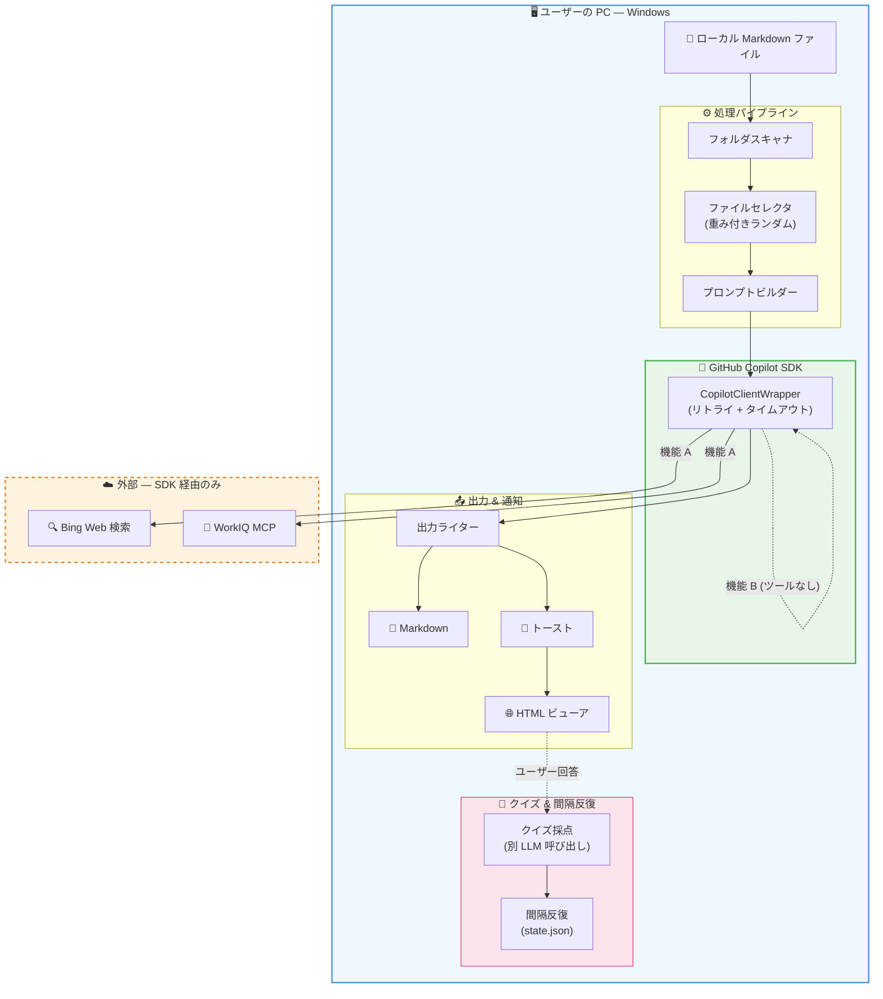

# Personal AI Daily Briefing Agent

> **[日本語版はこちら / Japanese version below](#日本語)**

Many users save knowledge locally as Markdown files — research results from LLM conversations, task management notes, learning logs, and more. This **Windows-only** desktop application leverages those local Markdown files as personal context: it periodically reads them from specified folders, retrieves and summarizes the latest information tailored to your interests, and generates review quizzes to reinforce learning — all powered by the **GitHub Copilot SDK**.

## Features

- **Feature A — News Briefing**: Searches and summarizes the latest news & technical updates on topics found in your notes
- **Feature B — Review & Quiz**: Auto-generates Q1 (multiple choice) + Q2 (written) quizzes based on your note content, with scoring
- **Spaced Repetition**: Automatic review interval adjustment per topic based on quiz results (simplified SM-2, Level 0–5)
- **System Tray**: Background operation via `pystray` with manual run menu
- **Toast Notifications**: Windows native notifications via `winotify`
- **MD Viewer**: HTML rendering via `tkinterweb` with quiz answer form
- **Internal Knowledge Search**: WorkIQ MCP server integration (optional)
- **Bilingual UI**: Full Japanese / English support — switch in Settings

## Architecture



## Prerequisites

| Item | Requirement |
|---|---|
| OS | Windows 10 / 11 |
| Python | 3.11+ |
| GitHub CLI | `gh` command installed |
| GitHub Auth | Authenticated via `gh auth login` |
| Copilot License | GitHub Copilot license assigned |

## Quick Setup (Recommended)

Download (or `git clone`) the repository, then **double-click `install\start.bat`** — it handles everything automatically:

1. Install **uv** (Python package manager)
2. Install **Python 3.12** (via uv)
3. Install **GitHub CLI (`gh`)** (via winget)
4. Install dependencies
5. Launch the app

> **Want a desktop shortcut?** Double-click `install\create_shortcut.bat`.

### What you need beforehand

- **Windows 10 / 11**
- **Internet connection** (first run only)
- **GitHub Copilot license** (assigned by your organization admin)

> Python, uv, and gh CLI installation are all handled automatically by `install\start.bat`.

## Manual Installation (For Developers)

```bash
# Clone the repository
git clone <repository-url>
cd ghcpsdknotify

# Install dependencies & launch with uv
uv sync
uv run python -m app.main
```

## Launch

| Method | Command |
|--------|---------|
| One-click launch | Double-click `install\start.bat` |
| From terminal | `uv run python -m app.main` |

On first launch, the setup wizard will check the following prerequisites automatically:

1. GitHub CLI (`gh`) installation
2. GitHub authentication status
3. Copilot license
4. Target folder configuration

Once all checks pass, the app stays in the system tray and runs on schedule.

## Configuration (`config.yaml`)

Auto-generated on first launch. Key settings:

```yaml
# Target folders (multiple allowed)
input_folders:
  - C:\Users\user\docs\learning
  - C:\Users\user\docs\projects

# Output folder name (created under the first input_folder)
output_folder_name: _briefings

# Execution schedule (independent per feature)
schedule:
  feature_a:
    - day_of_week: mon-fri
      hour: "9"
  feature_b:
    - day_of_week: mon,wed,fri
      hour: "8"

# Copilot SDK settings
copilot_sdk:
  model: claude-sonnet-4.6
  reasoning_effort: medium
  max_context_tokens: 100000
  sdk_timeout: 120

# WorkIQ MCP (internal knowledge search, optional)
workiq_mcp:
  enabled: false
  url: ""

# Notification settings
notification:
  enabled: true
  open_file_on_click: true

# File selection
file_selection:
  max_files: 20
  discovery_interval: 5

# Quiz & spaced repetition settings
quiz:
  quiz_server_host: 127.0.0.1
  quiz_server_port: 0
  quiz_scoring_timeout: 30
  spaced_repetition:
    enabled: true
    max_level: 5
    intervals: [1, 3, 7, 14, 30, 60]

# Language (ja / en)
language: ja

# Log level
log_level: INFO
```

## System Tray Menu

- **Manual Run**: News (A) only / Review & Quiz (B) only / Both (A → B)
- **Settings**: Change schedule, folders, notifications, and language
- **Open Log**: Opens `logs/app.log` in default editor
- **Quit**: Exit the app

## Directory Structure

```
ghcpsdknotify/
├── install/
│   ├── start.bat            # One-click launch script
│   └── create_shortcut.bat  # Desktop shortcut creator
├── app/
│   ├── __init__.py
│   ├── main.py              # Entry point + orchestration
│   ├── config.py            # Configuration file management
│   ├── state_manager.py     # Internal state (state.json)
│   ├── folder_scanner.py    # Folder scanning + frontmatter parsing
│   ├── file_selector.py     # File selection (interest scoring)
│   ├── copilot_client.py    # Copilot SDK wrapper
│   ├── output_writer.py     # Markdown file output
│   ├── scheduler.py         # APScheduler management
│   ├── logger.py            # Log configuration
│   ├── notifier.py          # Toast notifications
│   ├── viewer.py            # Markdown previewer
│   ├── quiz_server.py       # Local HTTP server (quiz scoring)
│   ├── quiz_scorer.py       # Quiz scoring logic
│   ├── spaced_repetition.py # Spaced repetition algorithm
│   ├── setup_wizard.py      # Setup wizard
│   ├── settings_ui.py       # Settings GUI
│   ├── i18n.py              # Internationalization (ja/en)
│   ├── sample_data.py       # Sample data generator
│   └── utils.py             # Utilities (atomic write, etc.)
├── tests/                   # Unit tests
├── settings/                # config.yaml & state.json (auto-generated)
├── logs/                    # Log output
├── pyproject.toml
└── README.md
```

## Responsible AI

This application is designed with the following data-privacy and security principles:

- **No direct external communication**: The app never opens its own network connections to external services. All LLM interactions go exclusively through the **GitHub Copilot CLI (`gh copilot`)** via the Copilot SDK, inheriting its authentication, encryption, and data-handling policies.
- **Local-only file access**: Markdown files are read from user-configured local folders. Files are never uploaded — only their text content is included in prompts sent through the SDK.
- **Read-only / create-only**: The agent only **reads** existing files and **creates** new output files (briefings, quiz results). It never modifies or deletes any existing user files.
- **No PII collection**: The agent does not collect, store, or transmit personally identifiable information. Only file paths and note content appear in prompts.
- **Transparent local storage**: Quiz scoring results and spaced-repetition state are stored locally in `settings/state.json`. Users can inspect and delete this data at any time.
- **Full user control**: All features (scheduling, WorkIQ integration, language) are configurable via `settings/config.yaml` or the built-in Settings UI. Users can disable any feature or adjust schedules freely.

## License

MIT License — see [LICENSE](LICENSE) for details.

---

<a id="日本語"></a>

# パーソナル AI デイリーブリーフィング Agent

LLM を使った調査結果の保存、タスク管理、学習メモなど、日常的にさまざまなナレッジを Markdown ファイルとしてローカルに蓄積しているユーザーは少なくありません。本アプリケーションはそうした**ローカルの Markdown ファイルを個人のコンテキスト**として活用し、指定フォルダから定期的に読み込み、GitHub Copilot SDK を用いてユーザーの関心に合った最新情報の取得・要約やクイズによる学習強化を行い、結果を Markdown ファイルとして出力する **Windows 専用** デスクトップアプリケーションです。

## 主な機能

- **機能 A — 最新情報の取得**: ノート内のトピックについて最新ニュース・技術アップデートを検索・要約
- **機能 B — 復習・クイズ**: ノート内容に基づく Q1（4択）+ Q2（記述）クイズの自動生成・採点
- **間隔反復**: クイズ結果に基づくトピック別の出題間隔自動調整（SM-2 簡略版、Level 0〜5）
- **システムトレイ常駐**: `pystray` によるバックグラウンド動作 + 手動実行メニュー
- **トースト通知**: `winotify` による Windows ネイティブ通知
- **MD プレビューア**: `tkinterweb` による HTML レンダリング + クイズ回答フォーム
- **WorkIQ MCP 連携**: 社内ナレッジ検索（オプション）
- **多言語対応**: 日本語 / 英語 — 設定画面で切替

## アーキテクチャ



## 前提条件

| 項目 | 要件 |
|---|---|
| OS | Windows 10 / 11 |
| Python | 3.11 以上 |
| GitHub CLI | `gh` コマンドがインストール済み |
| GitHub 認証 | `gh auth login` で認証済み |
| Copilot ライセンス | GitHub Copilot のライセンスが割り当て済み |

## かんたんセットアップ（推奨）

GitHub からリポジトリをダウンロード（または `git clone`）し、**`install\start.bat` をダブルクリック** するだけで以下を自動実行します:

1. **uv**（Python パッケージマネージャー）のインストール
2. **Python 3.12** のインストール（uv 経由）
3. **GitHub CLI (`gh`)** のインストール（winget 経由）
4. 依存パッケージのインストール
5. アプリの起動

> **デスクトップショートカットを作成したい場合**: `install\create_shortcut.bat` をダブルクリックしてください。

### ユーザーが事前に用意するもの

- **Windows 10 / 11**
- **インターネット接続**（初回のみ必要）
- **GitHub Copilot ライセンス**（組織管理者が割り当て済みであること）

> Python・uv・gh CLI のインストールは `install\start.bat` がすべて自動処理します。

## 手動インストール（開発者向け）

```bash
# リポジトリをクローン
git clone <repository-url>
cd ghcpsdknotify

# uv で依存パッケージをインストール & 起動
uv sync
uv run python -m app.main
```

## 起動方法

| 方法 | コマンド |
|------|---------|
| ワンクリック起動 | `install\start.bat` をダブルクリック |
| ターミナルから起動 | `uv run python -m app.main` |

初回起動時にセットアップウィザードが表示され、以下の前提条件を自動チェックします:

1. GitHub CLI (`gh`) のインストール
2. GitHub 認証状態
3. Copilot ライセンス
4. 読み込み対象フォルダの設定

すべてのチェックをパスすると、システムトレイに常駐し、スケジュールに従って自動実行されます。

## 設定ファイル (`config.yaml`)

アプリ起動時に自動生成されます。主な設定項目:

```yaml
# 読み込み対象フォルダ（複数指定可）
input_folders:
  - C:\Users\user\docs\learning
  - C:\Users\user\docs\projects

# 出力フォルダ名（最初の input_folder 直下に作成）
output_folder_name: _briefings

# 実行スケジュール（機能ごとに独立設定）
schedule:
  feature_a:
    - day_of_week: mon-fri
      hour: "9"
  feature_b:
    - day_of_week: mon,wed,fri
      hour: "8"

# Copilot SDK 設定
copilot_sdk:
  model: claude-sonnet-4.6
  reasoning_effort: medium
  max_context_tokens: 100000
  sdk_timeout: 120

# WorkIQ MCP（社内情報検索、オプション）
workiq_mcp:
  enabled: false
  url: ""

# 通知設定
notification:
  enabled: true
  open_file_on_click: true

# ファイル選定
file_selection:
  max_files: 20
  discovery_interval: 5

# クイズ・間隔反復設定
quiz:
  quiz_server_host: 127.0.0.1
  quiz_server_port: 0
  quiz_scoring_timeout: 30
  spaced_repetition:
    enabled: true
    max_level: 5
    intervals: [1, 3, 7, 14, 30, 60]

# 言語設定 (ja / en)
language: ja

# ログレベル
log_level: INFO
```

## システムトレイメニュー

- **手動実行**: 最新情報（A）のみ / 復習・クイズ（B）のみ / 両方（A → B）
- **設定**: スケジュール・フォルダ・通知・言語の変更ダイアログ
- **ログを開く**: `logs/app.log` を OS デフォルトエディタで表示
- **終了**: アプリを終了

## Responsible AI（責任ある AI）

本アプリケーションは、以下のデータプライバシー・セキュリティ原則に基づいて設計されています:

- **外部との直接通信なし**: アプリは独自のネットワーク接続を一切行いません。すべての LLM 通信は **GitHub Copilot CLI (`gh copilot`)** を経由する Copilot SDK のみを使用し、認証・暗号化・データ保護ポリシーをそのまま継承します。
- **ローカルファイルのみ読み取り**: Markdown ファイルはユーザーが設定したローカルフォルダから読み込まれます。ファイル自体は一切送信されず、テキスト内容のみが SDK 経由のプロンプトに含まれます。
- **読み取り専用・新規作成のみ**: 既存ファイルの**読み取り**と新規出力ファイル（ブリーフィング・クイズ結果）の**作成**のみを行います。既存のユーザーファイルを変更・削除することは一切ありません。
- **PII 不収集**: 個人を特定できる情報の収集・保存・送信は行いません。プロンプトに含まれるのはファイルパスとノート内容のみです。
- **透過的なローカル保存**: クイズ採点結果と間隔反復の状態は `settings/state.json` にローカル保存されます。ユーザーはいつでもデータを確認・削除できます。
- **ユーザーによる完全制御**: すべての機能（スケジュール・WorkIQ 連携・言語）は `settings/config.yaml` または設定 UI から自由に変更・無効化できます。

## ライセンス

MIT License — 詳細は [LICENSE](LICENSE) を参照
