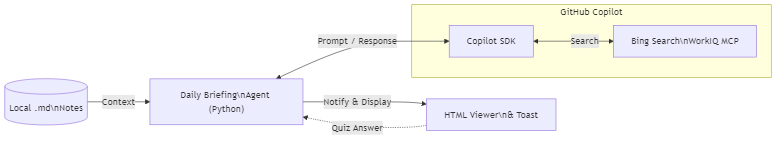

# Personal AI Daily Briefing Agent — Presentation (2 Slides)

---

## Slide 1: Problem & Solution

### Problem: The Barrier to Leveraging Generative AI

- **Context Window Limits**: While LLMs are powerful, the challenge lies in **how to ingest and utilize** the vast amount of personal knowledge (notes, memos, learning records) a user possesses. Users want information optimized for them, not generic answers.
- **Privacy Concerns**: Local files often contain sensitive information or business notes. Uploading them to the cloud or sending them directly to external APIs poses significant risks.

### Solution: Personal AI Daily Briefing Agent

A Windows desktop application that automatically extracts local Markdown notes as context to deliver **personalized information and enhance learning**.

| Feature | Overview | SDK Usage |
|---------|----------|-----------|
| **Feature A — Daily Briefing** | Searches and summarizes the latest news based on note topics | Copilot SDK + Bing + WorkIQ MCP |
| **Feature B — Review Quiz** | Auto-generates Q1 (multiple-choice) & Q2 (free-form) from notes, scored by LLM | Copilot SDK (No tools) |
| **Spaced Repetition** | Auto-adjusts quiz intervals based on results (SM-2: 1→3→7→14→30→60 days) | — |

**Context Ingestion Strategy**: Uses weighted random selection + discovery rotation to send up to `max_files` (default 20) to the LLM, ensuring the most valuable files are selected within the limited context window.

---

## Slide 2: Architecture

| Tech Stack | Python 3.12 · uv · Copilot SDK · APScheduler · pystray · winotify · tkinterweb · pytest |
|------------|--|

**GitHub**: <https://github.com/shitada/ghcpsdknotify> | **License**: MIT
